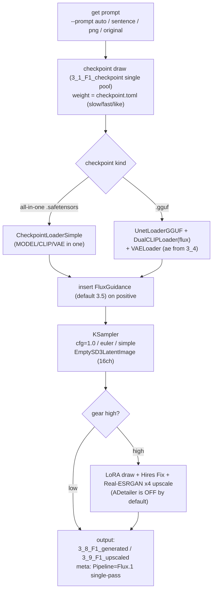

# Flux Portrait Image Generation Environment

[日本語はこちら](README_ja.md)

An environment for creating portrait images with Flux (Flux.1). It drives ComfyUI over its HTTP API and handles everything from automatic tensor triage to continuous generation, upscaling, preview rendering, and gallery browsing, via CLI and GUI.

- **Target scope**: **Flux.1 dev family / GGUF Q4_K_S or Q4_K_M recommended** (choose by inference settings).
- **VRAM**: works from 8GB (verified on RTX 3060 Ti). GGUF Q4 mostly fits in 8GB and is fast. Full fp8/bf16 runs via offloading but is slow.
- Supports both all-in-one safetensors (`CheckpointLoaderSimple`) and GGUF unet (`UnetLoaderGGUF` + separate text encoders).

> **About NSFW**: The Flux.1 dev base model is trained with explicit anatomy filtered out, so vanilla dev breaks down (extrapolates) on it. Use **NSFW finetune checkpoints / LoRAs** for explicit content (this environment handles them as-is). No censorship/filter is built into this tool.

## Console Language

Console output (logs, progress, `--help`) supports English and Japanese.
Choose the language with the `PLAYGROUND_LANG` env var (`en` / `ja`). If unset, it is auto-detected from the OS locale (Japanese environment → `ja`, otherwise → `en`).

``` powershell
$env:PLAYGROUND_LANG = "en"   # force English
$env:PLAYGROUND_LANG = "ja"   # force Japanese
```

Image metadata (the PNG `parameters` chunk, e.g. the `Pipeline:` field) is **always written in English** regardless of this setting.

## Setup

Install PyTorch **first**, matched to your environment (it is not in this project's `requirements.txt`). Install ComfyUI and the Impact Pack; install ComfyUI-GGUF if you use GGUF.

### Windows

``` powershell
cd ~
git clone <this repository> flux_playground
cd flux_playground
python -m venv .venv
.\.venv\Scripts\Activate.ps1
# Install PyTorch first, matched to your environment (uninstall first when replacing a CPU build to avoid it being kept)
pip install --index-url https://download.pytorch.org/whl/cu128 torch torchvision
# Project dependencies (ComfyUI client only; does NOT include torch/diffusers)
pip install -r requirements.txt
# ComfyUI + custom nodes
git clone https://github.com/comfyanonymous/ComfyUI
cd ComfyUI\custom_nodes
git clone https://github.com/ltdrdata/ComfyUI-Impact-Pack
git clone https://github.com/ltdrdata/ComfyUI-Impact-Subpack
git clone https://github.com/city96/ComfyUI-GGUF        # if using GGUF
cd ..\..
pip install -r ComfyUI\requirements.txt
pip install -r ComfyUI\custom_nodes\ComfyUI-Impact-Pack\requirements.txt
pip install -r ComfyUI\custom_nodes\ComfyUI-Impact-Subpack\requirements.txt
pip install gguf                                          # if using GGUF
```

### Linux/macOS

``` bash
cd ~
git clone <this repository> flux_playground
cd flux_playground
python -m venv .venv
source .venv/bin/activate
pip install --index-url https://download.pytorch.org/whl/cu128 torch torchvision
pip install -r requirements.txt
git clone https://github.com/comfyanonymous/ComfyUI
cd ComfyUI/custom_nodes
git clone https://github.com/ltdrdata/ComfyUI-Impact-Pack
git clone https://github.com/ltdrdata/ComfyUI-Impact-Subpack
git clone https://github.com/city96/ComfyUI-GGUF        # if using GGUF
cd ../..
pip install -r ComfyUI/requirements.txt
pip install -r ComfyUI/custom_nodes/ComfyUI-Impact-Pack/requirements.txt
pip install -r ComfyUI/custom_nodes/ComfyUI-Impact-Subpack/requirements.txt
pip install gguf                                          # if using GGUF
```

### Placing models

| File | Destination | Notes |
|---|---|---|
| Flux checkpoint (all-in-one .safetensors) | `2_0_tensors/` (→ triaged to `3_1_F1_checkpoint`) | bundles model+clip+vae; loaded in one shot by `CheckpointLoaderSimple` |
| Flux GGUF unet (e.g. `flux1-dev-Q4_K_S.gguf`) | `2_0_tensors/` (→ `3_1_F1_checkpoint`) | transformer only; needs the text encoders and VAE below |
| `clip_l.safetensors` | `ComfyUI/models/clip/` | text encoder for GGUF |
| `t5xxl_fp8_e4m3fn.safetensors` | `ComfyUI/models/clip/` | text encoder for GGUF (fp8 recommended) |
| Flux VAE (ae, e.g. `ae.safetensors`) | `2_0_tensors/` (→ `3_4_F1_VAE`) | required for GGUF; optional for all-in-one (uses bundled VAE) |

GGUF vs all-in-one depends on your inference settings. On 8GB VRAM, **dev GGUF Q4_K_S (~6.8GB)** fits well and is fast.

## Directory Layout

- `./` : scripts and config files
- `1_0_prompts` : place prompt-bearing PNGs here (for `--png` / `--png-sentence`)
- `2_0_tensors` : place tensors of unknown kind here (intake tray)
- `2_1_errortensors` : broken / duplicate / inpainting / **SD15・SDXL** / undetectable (low-quality lane)
- `2_3_hightensors` : **F2 (Flux.2)** family. High-end tensors F1 can't handle, parked here (future `4_x`)
- `3_1_F1_checkpoint` : Flux checkpoints (all-in-one .safetensors / GGUF unet)
- `3_2_F1_LoRA` : Flux LoRAs
- `3_3_F1_ControlNet` : Flux ControlNets (manual placement; not scanned)
- `3_4_F1_VAE` : Flux VAE (ae)
- `3_5_F1_Embedding` : Flux Embeddings (CLIP-L / T5 based)
- `3_8_F1_generated` : generated PNGs (with A1111-compatible metadata)
- `3_9_F1_upscaled` : upscaled PNGs (with metadata)

`dist_tensors.py` triages tensors by inspecting file headers (safetensors JSON / GGUF metadata).
**Flux (F1) → `3_x_F1_*` / F2 → `2_3_hightensors` / SD15・SDXL・broken・undetectable → `2_1_errortensors`**.

## Quickest Workflow

1. Put checkpoint / LoRA / VAE tensors into `2_0_tensors`.

2. Run the triage.

```
python dist_tensors.py
```

3. Generate images.

```
python generate.py --sentence "a woman walking with umbrella outside"
```

Normal images go to `3_8_F1_generated`, upscaled images to `3_9_F1_upscaled` (with `--gear high`).

> Run with the **`.venv` python** (ComfyUI is also auto-launched with the `.venv` python). When invoking from a shell, specify `.venv/Scripts/python.exe` explicitly.

## Generation Flow (diagram)

A single `generate.py` image roughly follows this flow.



Key points:

- **Flux dev is guidance-distilled**: KSampler runs at **cfg=1.0**, and guidance is provided by the **FluxGuidance node (default 3.5)**. **The negative prompt is effectively inert at cfg=1.**
- **Quality of hands/face/body is asserted positively in the prompt** (instead of a negative `bad hands`, write `detailed hands, five fingers` as a positive statement). `prompt.toml`'s `positive_always` holds this.
- **ADetailer is OFF by default.** Flux renders faces/hands at high native fidelity, so it is unnecessary, and on 8GB the per-region re-sampling is the heaviest step. Enable with `--adetailer` only when needed.
- For **GGUF**, the graph auto-branches to `UnetLoaderGGUF` + `DualCLIPLoader` + `VAELoader` (all-in-one uses `CheckpointLoaderSimple` in one shot).
- Default resolution is **1024×1024**; landscape (many) is **1216×832**.

## Prompt Config: prompt.toml

Describes the keywords used to build prompts. Emphasis syntax: `*…*` (1.1x), `**…**` (1.3x), `***…***` (1.5x).

Each section is drawn and joined with commas into one positive. The **LoRA keywords** (below) of chosen entries are aggregated too.

- **who**: `[character, weight, has_wearing, has_motion, has_where, many, lora_kw]`

```
["**a woman**", 20, false, false, false, false, ""],
["**a school wear woman**", 10, true, false, false, false, "school wear"],
["**2 women kissing**", 5, true, true, false, true, "kiss"],
```

  - `has_wearing/has_motion/has_where` … true if embedded in the character string (skips that section); false to draw it
  - `many` … true for multi-person entries. When true, generates on a landscape canvas (`--many-width` × `--many-height`, default 1216×832) to suppress subject merging
- **wearing**: `["dress", 10, "dress"]` → "wearing dress". `""`/`"nothing"` → "naked"
- **with_items**: `["earring", 10, "jewel"]` → "with earring". Drawn up to 3 times
- **motion**: `["sitting", 50, ""]`
- **at**: `["beach", 5, ""]` → "at beach"
- **lighting**: uniform draw → "with {lighting}"
- **positive_always**: always appended at the end. Put photorealistic tags + positive statements for hands/face/body here (e.g. `photorealistic, raw photo, detailed hands with five fingers, anatomically correct body, ...`)
- **negative_always**: the negative body. But since **Flux is cfg=1 and the negative is inert**, it is largely decorative

> (Optional) Adding an `expression` section (a list of strings) appends one random expression/mood phrase per image (`build_prompt` handles it like `lighting`).

## Scripts

### Tensor triage: dist_tensors.py

```
python dist_tensors.py
```

Triages tensors in `2_0_tensors` (also unzips / converts ckpt→safetensors / detects hash duplicates; safe to run repeatedly).

- From headers (safetensors JSON / GGUF metadata), determines **kind** (base / lora / controlnet / vae / embedding / inpainting / broken) and **family** (flux1 / flux2 / sdxl / sd15 / unknown).
- Destinations: F1 → `3_1`–`3_5` / **F2 → `2_3_hightensors`** / SD-family, broken, undetectable → `2_1_errortensors`.
- For hash duplicates, keeps the newer mtime and moves the older to `2_1_errortensors`. `3_3_F1_ControlNet` / `2_1` / `2_3` are not scanned (manual placement respected).
- Linked files: `tensors_cache.toml` (hash cache), `F1_LoRA_hint.toml` (LoRA subject), `checkpoint.toml` (appends unregistered checkpoints), `F1_categories` in `LoRA_preview.toml` (adds missing as `ware`).

In `F1_LoRA_hint.toml`, only **`subject="pose"`** is functional (pose LoRAs are auto-excluded when OpenPose is in use).

### Generation: generate.py

```
python generate.py
```

Generates images continuously. The `dist_tensors` triage runs first. Output goes to `3_8_F1_generated`・`3_9_F1_upscaled` as `YYYYMMDDHHMMSS.png`. A (device temp − 50) second cooldown runs between images. `Ctrl+C` to stop.

#### Prompt (input source)

- none (`--prompt auto`, default): build from `prompt.toml` and generate continuously
- `--sentence "<text>" [--lora-keywords "kw,..."]`: continuous generation from text + LoRA keywords
- `--png <PNG>`: quality-up refine via **Flux img2img** of that image (**single image, then exits**). `--refine-denoise` (default 0.5)
- `--png-sentence <PNG>`: continuous generation from the PNG's embedded prompt text (the image itself is not used)
- `--prompt original --png-sentence <PNG>`: reuse all of the PNG's checkpoint・LoRA・prompt metadata

#### Checkpoint draw / checkpoint.toml

Fix with `--checkpoint <name>`. The pool is the single `3_1_F1_checkpoint` (both .safetensors and .gguf). The first pick is a random unmeasured one; later picks are 2/3 measured (weighted) / 1/3 unmeasured. Weight = `((max slow*2)-(fast+slow))/2+like`.

`checkpoint.toml` fields:
- `slow` / `fast` : max / min time for one image (s)
- `like` : preference (signed; added to draw weight)
- `inference` : extra inference steps (signed)
- `style` : `anime` / `real` / `mix` / `""` (used for upscale-model selection)
- `family` : filename-guessed family tag (informational; auto-appended on first `--gear high` if unregistered)

#### Gear

- `--gear low` : rough generation (20 steps, plain txt2img, no LoRA/ControlNet/Hires/upscale/ADetailer)
- `--gear high` : production (28 steps, LoRA draw, Hires Fix, Real-ESRGAN x4 upscale). **ADetailer OFF by default**

`--gear high` is the default.

#### Main options

- `--cfg-scale` (default **1.0**) / `--guidance` (FluxGuidance, default **3.5**)
- `--sampler` (default **euler**) / `--scheduler` (default **simple**)
- `--width` / `--height` (default 1024) / `--many` / `--many-width` / `--many-height` (default 1216×832)
- `--flux-vae <name>` : use an ae from `3_4_F1_VAE` via VAELoader (all-in-one uses bundled VAE if unset; GGUF auto-uses an ae from 3_4 if unset)
- `--clip-l` / `--t5xxl` : text encoder names for GGUF (default `clip_l.safetensors` / `t5xxl_fp8_e4m3fn.safetensors`, under `ComfyUI/models/clip`)
- `--adetailer` : enable ADetailer (OFF by default)
- `--hires-fix` / `--no-hires-fix`, `--upscale` / `--no-upscale` : override the gear-linked defaults
- `--lora-scale` (total 0.8) / `--lora-stack-min` (3) / `--lora-stack-max` (5, 0 disables LoRA)
- `--arch cuda|cpu` (default cuda) / `--cooldown` / `--seed`

#### LoRA keywords / draw

A word list, separate from the prompt text, that selects LoRAs. Case-insensitive; space = AND, comma = OR.
Decide LoRA count (default 3–5) → draw by keywords (97% searches LoRA name/meta/`LoRA_keywords.toml`, 3% from all LoRAs).
LoRA keywords are appended to the positive with weight `(0.8/count)*word`. Check combinations with `lora_chance_ui.py`.

#### ControlNet

Fix with `--controlnet <name>`. Applied when `3_3_F1_ControlNet` has files and a reference image (`--png` etc.) is present. `--pose <PNG>` forces OpenPose (requires an openpose-type file in `3_3_F1_ControlNet`).
Note: Flux ControlNet and preprocessor nodes (`DWPreprocessor` etc.) require separate custom nodes.

#### Workflow visualization (debug)

- `--dump-workflow` : also save the submitted workflow to `workflow_dump/<time>_<kind>.json` (generation runs normally)
- `--dump-only` : only emit the workflow JSON without submitting to ComfyUI (no GPU; one image then exits)

Drag the output JSON onto the ComfyUI WebUI canvas (http://127.0.0.1:8188) to visualize the graph.

### Image Generation GUI: generate_gui.py

```
python generate_gui.py
```

A manual image-generation GUI (Tkinter). Generate 1–300 images in batches with instant gallery display.

- **Checkpoint**: select from `3_1_F1_checkpoint` (GGUF shown with a `[GGUF]` tag). Thumbnails (`<name>.preview.png`) shown alongside
- **LoRA**: multi-select from `3_2_F1_LoRA`. **ControlNet**: `3_3_F1_ControlNet` (wired when a reference image is dropped)
- **Settings dialog** (persisted to `generate_gui.toml`): CFG (default 1.0) / **Guidance (3.5)** / Steps / Seed / width / height / Sampler (euler default) / Scheduler (simple default) / LoRA total strength / AD correction (OFF by default) / Hires options
- **Gallery**: thumbnails added per image. Click for full size; right-click to delete / upscale
- Output to `3_8_F1_generated` / `3_9_F1_upscaled`. When GGUF is selected, an ae from `3_4_F1_VAE` is auto-used

### Preview Rendering: make_previews.py

```
python make_previews.py                      # all checkpoints + LoRAs (skips existing sidecars)
python make_previews.py --only lora --limit 2
python make_previews.py --dry-run            # show plan without generating
python make_previews.py --init-categories    # initialize F1_categories
```

Renders `<name>.preview.png` sidecars per tensor. Checkpoints use themselves; LoRAs use a representative Flux base from `3_1_F1_checkpoint` (specifiable via `--base`, GGUF OK) + trigger words for one image. Flux defaults (cfg=1 / guidance=3.5 / euler / simple).

### Tensor Info Viewer: tensors_view.py

```
python tensors_view.py [--dir <directory>] [--list]
```

A Tkinter viewer that raw-reads `safetensors` headers to list metadata, tensor count, dtype, and size (torch-free).
Detects family as flux / SDXL / SD15 (SD families retained for browsing legacy tensors in `2_1_errortensors`). Supports sidecar preview display/regeneration and editing LoRA preview categories (`F1_categories` / `F1_prompts` in `LoRA_preview.toml`). When `--dir` is omitted, opens the first entry of `preview_settings.toml [tensors_dirs].list`.

### Image Gallery: gallery.py

```
python gallery.py [--list]
```

A read-only Tkinter viewer that recursively scans `3_8_F1_generated` / `3_9_F1_upscaled`. Reads A1111-compatible metadata for thumbnails + a metadata list, with search/sort/filter. Detects and color-codes Flux via the `Pipeline` field.

### PNG Prompt Utility: pngutil.py

```
python pngutil.py <PNG file>            # inspect
python pngutil.py <PNG> --sentence "..." # change prompt text
python pngutil.py <PNG> --lora "..."     # change LoRA keywords
python pngutil.py <PNG> --erase          # remove text info
```

For a prompt-bearing PNG viewer, [stable-diffusion-prompt-reader](https://github.com/receyuki/stable-diffusion-prompt-reader) is handy.

### LoRA Selection-Probability Check: lora_chance_ui.py

```
python lora_chance_ui.py
```

Graphs the top-30 LoRA selection probabilities over 300 draws (`random` / `manual` / `lora_keyword`).

## Config Files

- `prompt.toml` : prompt-building keywords (above)
- `checkpoint.toml` : checkpoint info (slow/fast/like/inference/style/family)
- `LoRA_keywords.toml` : per-LoRA search keywords
- `F1_LoRA_hint.toml` : LoRA subject (only `pose` is functional)
- `LoRA_preview.toml` : `[F1_categories]` (stem→category) / `[F1_prompts]` (stem→custom positive)
- `preview_settings.toml` : `[tensors_dirs]` (viewer candidate dirs) / `[LoRA_preview_template]` / `[checkpoint_preview_template]`
- `tensors_cache.toml` : dist_tensors hash cache (auto-generated)
- `generate_gui.toml` : GUI persisted settings (auto-generated)

## ADetailer Model Auto-Placement

When using `--adetailer`, the following are auto-downloaded if missing.
- `ComfyUI/models/ultralytics/bbox/face_yolov8s.pt`
- `ComfyUI/models/ultralytics/bbox/hand_yolov8s.pt`
- `ComfyUI/models/ultralytics/segm/person_yolov8s-seg.pt`

## License

GPL-3.0
