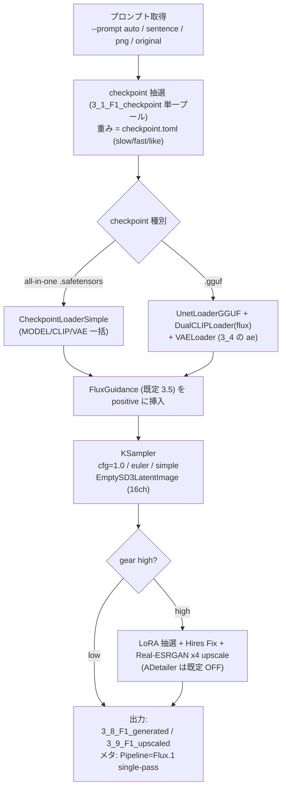

# Flux 人物画像生成環境

[English here](README.md)

Flux (Flux.1) の人物画像制作環境です。ComfyUI を HTTP API 経由で叩き、テンソルの自動振り分けから連続生成・アップスケール・プレビュー・ギャラリー閲覧までを CLI / GUI でまとめて行います。

- **対象スコープ**: **Flux.1 dev 系 / GGUF Q4_K_S または Q4_K_M 推奨**（推論値設定により選択）。
- **VRAM**: 8GB から動作（RTX 3060 Ti で検証）。GGUF Q4 なら 8GB にほぼ載る。フル fp8/bf16 はオフロードで動くが遅い。
- all-in-one safetensors（`CheckpointLoaderSimple`）と GGUF unet（`UnetLoaderGGUF` + 別途テキストエンコーダ）の両方に対応。

> **NSFW について**: Flux.1 dev のベースモデルは露骨な解剖表現を学習除外しているため、素の dev では破綻（外挿）します。露骨表現には **NSFW finetune の checkpoint / LoRA** を使ってください（本環境はそれをそのまま扱えます）。フィルタ等の検閲は本ツール側には入っていません。

## コンソール言語

コンソール出力（ログ・進捗・`--help`）は英語／日本語に対応。
言語は環境変数 `PLAYGROUND_LANG`（`en` / `ja`）で選ぶ。未設定なら OS ロケールから自動判定（日本語環境→`ja`、その他→`en`）。

``` powershell
$env:PLAYGROUND_LANG = "en"   # 英語に固定
$env:PLAYGROUND_LANG = "ja"   # 日本語に固定
```

画像メタデータ（PNG の `parameters` チャンク、例 `Pipeline:` フィールド）は、この設定に関わらず**常に英語**で書き出される。

## 初期設定

PyTorch は環境に合わせて**先に**入れる（本体の `requirements.txt` には含めない）。ComfyUI と Impact Pack、GGUF を使う場合は ComfyUI-GGUF を導入する。

### Windows

``` powershell
cd ~
git clone <このリポジトリ> flux_playground
cd flux_playground
python -m venv .venv
.\.venv\Scripts\Activate.ps1
# PyTorch を環境に合わせて先に入れる（CPU 版に上書きされる事故を避けるため、入れ替え時は uninstall してから）
pip install --index-url https://download.pytorch.org/whl/cu128 torch torchvision
# 本体の依存（ComfyUI クライアントのみ。torch/diffusers は含まない）
pip install -r requirements.txt
# ComfyUI 本体 + custom node
git clone https://github.com/comfyanonymous/ComfyUI
cd ComfyUI\custom_nodes
git clone https://github.com/ltdrdata/ComfyUI-Impact-Pack
git clone https://github.com/ltdrdata/ComfyUI-Impact-Subpack
git clone https://github.com/city96/ComfyUI-GGUF        # GGUF を使う場合
cd ..\..
pip install -r ComfyUI\requirements.txt
pip install -r ComfyUI\custom_nodes\ComfyUI-Impact-Pack\requirements.txt
pip install -r ComfyUI\custom_nodes\ComfyUI-Impact-Subpack\requirements.txt
pip install gguf                                          # GGUF を使う場合
```

### Linux/macOS

``` bash
cd ~
git clone <このリポジトリ> flux_playground
cd flux_playground
python -m venv .venv
source .venv/bin/activate
pip install --index-url https://download.pytorch.org/whl/cu128 torch torchvision
pip install -r requirements.txt
git clone https://github.com/comfyanonymous/ComfyUI
cd ComfyUI/custom_nodes
git clone https://github.com/ltdrdata/ComfyUI-Impact-Pack
git clone https://github.com/ltdrdata/ComfyUI-Impact-Subpack
git clone https://github.com/city96/ComfyUI-GGUF        # GGUF を使う場合
cd ../..
pip install -r ComfyUI/requirements.txt
pip install -r ComfyUI/custom_nodes/ComfyUI-Impact-Pack/requirements.txt
pip install -r ComfyUI/custom_nodes/ComfyUI-Impact-Subpack/requirements.txt
pip install gguf                                          # GGUF を使う場合
```

### モデルの配置

| ファイル | 配置先 | 備考 |
|---|---|---|
| Flux checkpoint（all-in-one .safetensors） | `2_0_tensors/`（→振り分けで `3_1_F1_checkpoint`） | model+clip+vae 同梱。`CheckpointLoaderSimple` で一括ロード |
| Flux GGUF unet（例 `flux1-dev-Q4_K_S.gguf`） | `2_0_tensors/`（→`3_1_F1_checkpoint`） | transformer 単体。下のテキストエンコーダと VAE が別途必要 |
| `clip_l.safetensors` | `ComfyUI/models/clip/` | GGUF 用テキストエンコーダ |
| `t5xxl_fp8_e4m3fn.safetensors` | `ComfyUI/models/clip/` | GGUF 用テキストエンコーダ（fp8 推奨） |
| Flux VAE（ae、例 `ae.safetensors`） | `2_0_tensors/`（→`3_4_F1_VAE`） | GGUF では必須。all-in-one では同梱を使うので任意 |

GGUF / all-in-one の選択は推論値設定次第。8GB VRAM では **dev の GGUF Q4_K_S（〜6.8GB）**が載りやすく速い。

## ディレクトリ構成

- `./` : スクリプト・設定ファイル
- `1_0_prompts` ： プロンプト入りの PNG をユーザが配置する（`--png` / `--png-sentence` 用）
- `2_0_tensors` ： 種別不明なテンソルをユーザが配置する（受入トレー）
- `2_1_errortensors` ： 破損 / 重複 / inpainting / **SD15・SDXL** / 判別不能（低品質レーン）
- `2_3_hightensors` ： **F2 (Flux.2)** 系。F1 では扱えない高度テンソルの一時退避（将来 `4_x` 行き）
- `3_1_F1_checkpoint` ： Flux checkpoint（all-in-one .safetensors / GGUF unet）
- `3_2_F1_LoRA` ： Flux LoRA
- `3_3_F1_ControlNet` ： Flux ControlNet（手動配置、scan しない）
- `3_4_F1_VAE` ： Flux VAE（ae）
- `3_5_F1_Embedding` ： Flux Embedding（CLIP-L / T5 ベース）
- `3_8_F1_generated` ： 生成された PNG（A1111 互換メタ付き）が出力される
- `3_9_F1_upscaled` ： アップスケール後 PNG（メタ付き）が出力される

テンソルは `dist_tensors.py` がファイルヘッダ（safetensors の JSON / GGUF メタ）を見て自動振り分けする。
**Flux(F1) → `3_x_F1_*` / F2 → `2_3_hightensors` / SD15・SDXL・破損・判別不能 → `2_1_errortensors`**。

## 一番簡単な使い方

1. checkpoint / LoRA / VAE テンソルを `2_0_tensors` に入れる。

2. テンソル振り分けを実行する。

```
python dist_tensors.py
```

3. 画像生成を実行する。

```
python generate.py --sentence "a woman walking with umbrella outside"
```

`3_8_F1_generated` に通常画像、`3_9_F1_upscaled` にアップスケール画像が出力される（`--gear high` 時）。

> 実行は **`.venv` の python**（ComfyUI も `.venv` の python で自動起動される）。Bash 等で叩く場合は `.venv/Scripts/python.exe` を明示すること。

## 生成フロー（概念図）

`generate.py` 1 枚の生成は、おおむね次の流れで進む。



要点:

- **Flux dev は guidance 蒸留**: KSampler は **cfg=1.0** で回し、誘導は **FluxGuidance ノード（既定 3.5）** で与える。**negative は cfg=1 では実質無効**。
- **手・顔・身体の良好さは positive に肯定文で明記**して担保する（`bad hands` を避ける negative ではなく、`detailed hands, five fingers` を肯定文で書く）。`prompt.toml` の `positive_always` がこれを持つ。
- **ADetailer は既定 OFF**。Flux は顔/手を高精細にネイティブ生成するため不要で、8GB では検出領域ごとの再サンプリングが最も重い。必要時のみ `--adetailer`。
- **GGUF** のときは `UnetLoaderGGUF` + `DualCLIPLoader` + `VAELoader` のサブグラフに自動分岐（all-in-one は `CheckpointLoaderSimple` 一括）。
- 解像度の既定は **1024×1024**、横長 many は **1216×832**。

## プロンプト設定ファイル prompt.toml

プロンプトを生成するキーワードを記述する。重み記法あり：`*～*`（1.1倍）、`**～**`（1.3倍）、`***～***`（1.5倍）。

各セクションから抽選 → カンマ連結で 1 つの positive を組む。採用エントリの **LoRA キーワード**（後述）も集約される。

- **who**（だれが）：`[character, weight, has_wearing, has_motion, has_where, many, lora_kw]`

```
["**a woman**", 20, false, false, false, false, ""],
["**a school wear woman**", 10, true, false, false, false, "school wear"],
["**2 women kissing**", 5, true, true, false, true, "kiss"],
```

  - `has_wearing/has_motion/has_where` … キャラ文字列に内包していれば true（対応セクションをスキップ）、抽選させるなら false
  - `many` … 複数人エントリなら true。true のとき横長キャンバス（`--many-width` × `--many-height`、既定 1216×832）で人物融合を抑える
- **wearing**（着ているもの）：`["dress", 10, "dress"]` →「wearing dress」。`""`/`"nothing"` は「naked」
- **with_items**（装飾品・状況）：`["earring", 10, "jewel"]` →「with earring」。最大 3 回抽選
- **motion**（動作）：`["sitting", 50, ""]`
- **at**（場所）：`["beach", 5, ""]` →「at beach」
- **lighting**（照明）：均等抽選 →「with {lighting}」
- **positive_always**：必ず末尾に付加。写実タグ + 手/顔/身体の肯定文をここに置く（例：`photorealistic, raw photo, detailed hands with five fingers, anatomically correct body, ...`）
- **negative_always**：negative の本体。ただし **Flux は cfg=1 で negative が効かない**ため実質飾り

> （任意）`expression` セクション（文字列のリスト）を足すと、表情/ムードを毎枚ランダムに 1 句付加できる（`build_prompt` が `lighting` 同様に処理）。

## スクリプト

### テンソル振り分け dist_tensors.py

```
python dist_tensors.py
```

`2_0_tensors` のテンソルを振り分ける（zip 展開 / ckpt→safetensors 変換 / ハッシュ重複検出も行う、何度実行しても安全）。

- ヘッダ（safetensors の JSON / GGUF メタ）から **kind**（base / lora / controlnet / vae / embedding / inpainting / broken）と **系統**（flux1 / flux2 / sdxl / sd15 / unknown）を判定。
- 振り分け先：F1 → `3_1`〜`3_5` / **F2 → `2_3_hightensors`** / SD系・破損・判別不能 → `2_1_errortensors`。
- ハッシュ重複は mtime の新しい方を残し、古い方を `2_1_errortensors` へ。`3_3_F1_ControlNet` / `2_1` / `2_3` は scan しない（手動配置を尊重）。
- 連動ファイル：`tensors_cache.toml`（ハッシュ等キャッシュ）、`F1_LoRA_hint.toml`（LoRA の subject）、`checkpoint.toml`（未登録 checkpoint を追記）、`LoRA_preview.toml` の `F1_categories`（不足分を `ware` で追記）。

`F1_LoRA_hint.toml` の `subject` で機能的に意味を持つのは **`subject="pose"`** のみ（OpenPose 使用時に pose 系 LoRA を自動除外）。

### 生成 generate.py

```
python generate.py
```

画像を連続生成する。生成前に `dist_tensors` の振り分けが走る。出力は `3_8_F1_generated`・`3_9_F1_upscaled` に `YYYYMMDDHHMMSS.png`。1 枚ごとに（デバイス温度−50）秒の冷却。`Ctrl+C` で終了。

#### プロンプト（入力ソース）

- 指定なし（`--prompt auto` 既定）：`prompt.toml` から生成して連続生成
- `--sentence "<文章>" [--lora-keywords "kw,..."]`：文章 + LoRA キーワードで連続生成
- `--png <PNG>`：その画像を **Flux img2img** で描き直す画質アップ refine（**1 枚で終了**）。`--refine-denoise`（既定 0.5）
- `--png-sentence <PNG>`：PNG の埋込プロンプト『文章』で連続生成（画像は使わない）
- `--prompt original --png-sentence <PNG>`：PNG メタの checkpoint・LoRA・プロンプトを全部流用

#### checkpoint 抽選 / checkpoint.toml

`--checkpoint <name>` で固定。プールは `3_1_F1_checkpoint` 単一（.safetensors と .gguf 両方）。1 度めは未計測をランダム、2 度め以降は 2/3 で計測済み（重み付き）/ 1/3 で未計測。重み = `((slow最大*2)-(fast+slow))/2+like`。

`checkpoint.toml` の項目：
- `slow` / `fast` ： 1 枚生成の最大 / 最小時間(s)
- `like` ： 好み（正負値、抽選重みに加算）
- `inference` ： 追加推論ステップ（正負値）
- `style` ： `anime` / `real` / `mix` / `""`（アップスケールモデル選択に使用）
- `family` ： ファイル名推定の系統タグ（情報用。`--gear high` 初回に未登録なら自動追記）

#### ギア

- `--gear low` ： ラフ生成（推論数 **20**・純 txt2img・LoRA/ControlNet/Hires/upscale/ADetailer なし）
- `--gear high` ： 本番生成（推論数 **28**・LoRA 抽選・Hires Fix・Real-ESRGAN x4 upscale）。**ADetailer は既定 OFF**

`--gear high` が既定。

#### 主なオプション

- `--cfg-scale`（既定 **1.0**） / `--guidance`（FluxGuidance、既定 **3.5**）
- `--sampler`（既定 **euler**） / `--scheduler`（既定 **simple**）
- `--width` / `--height`（既定 1024） / `--many` / `--many-width` / `--many-height`（既定 1216×832）
- `--flux-vae <name>` ： `3_4_F1_VAE` の ae を VAELoader で明示使用（all-in-one は未指定で同梱 VAE。GGUF は未指定なら 3_4 の ae を自動使用）
- `--clip-l` / `--t5xxl` ： GGUF 用テキストエンコーダ名（既定 `clip_l.safetensors` / `t5xxl_fp8_e4m3fn.safetensors`、`ComfyUI/models/clip` 配下）
- `--adetailer` ： ADetailer を明示 ON（既定 OFF）
- `--hires-fix` / `--no-hires-fix` ・ `--upscale` / `--no-upscale` ： gear 連動の既定を上書き
- `--lora-scale`（合計 0.8） / `--lora-stack-min`（3） / `--lora-stack-max`（5、0 で LoRA OFF）
- `--arch cuda|cpu`（既定 cuda） / `--cooldown` / `--seed`

#### LoRA キーワード・抽選方式

文章とは別に LoRA を抽選するワード列。大小文字区別なし、スペース区切り=AND、コンマ区切り=OR。
LoRA 数決定（既定 3〜5）→ キーワードで抽選（97% は LoRA 名/メタ/`LoRA_keywords.toml` を検索、3% は全 LoRA から）。
LoRA キーワードは `(0.8/語数)*語` の重みで positive 末尾に加わる。組み合わせは `lora_chance_ui.py` で確認可。

#### ControlNet

`--controlnet <name>` で固定。`3_3_F1_ControlNet` にファイルがあり、リファレンス画像（`--png` 等）がある場合に適用。`--pose <PNG>` で OpenPose 強制（`3_3_F1_ControlNet` に openpose 系が必要）。
※ Flux ControlNet と前処理ノード（`DWPreprocessor` 等）は別途 custom node が必要。

#### workflow の可視化（デバッグ）

- `--dump-workflow` ： 投入する workflow を `workflow_dump/<時刻>_<種別>.json` に保存（生成は通常実行）
- `--dump-only` ： workflow JSON を吐くだけで ComfyUI へ投入しない（GPU 不使用、1 枚分で即終了）

出力 JSON を ComfyUI WebUI（http://127.0.0.1:8188）のキャンバスにドラッグするとグラフを可視化できる。

### 画像生成 GUI generate_gui.py

```
python generate_gui.py
```

マニュアル指定型の画像生成 GUI（Tkinter）。1〜300 枚をまとめて生成しつつギャラリーに即時表示。

- **チェックポイント**：`3_1_F1_checkpoint` を選択（GGUF は `[GGUF]` タグ表示）。サムネ（`<name>.preview.png`）を横に表示
- **LoRA**：`3_2_F1_LoRA` を複数選択。**ControlNet**：`3_3_F1_ControlNet`（リファレンス画像 D&D 時に配線）
- **設定ダイアログ**（`generate_gui.toml` に永続化）：CFG（既定 1.0）/ **Guidance（3.5）** / Steps / Seed / 幅 / 高さ / Sampler（euler 既定）/ Scheduler（simple 既定）/ LoRA 合計強度 / AD 補正（既定 OFF）/ Hires 各種
- **ギャラリー**：生成ごとにサムネ追加。クリックで原寸、右クリックで削除 / アップスケール
- 出力は `3_8_F1_generated` / `3_9_F1_upscaled`。GGUF 選択時は `3_4_F1_VAE` の ae を自動使用

### プレビュー生成 make_previews.py

```
python make_previews.py                      # 全 checkpoint + LoRA（既存サイドカーはスキップ）
python make_previews.py --only lora --limit 2
python make_previews.py --dry-run            # 生成せず計画表示
python make_previews.py --init-categories    # F1_categories を初期化
```

各テンソルの `<name>.preview.png` サイドカーを焼く。checkpoint はそのモデルで、LoRA は `3_1_F1_checkpoint` の代表 Flux ベース（`--base` で指定可、GGUF も可）+ トリガー語で 1 枚。Flux 既定（cfg=1 / guidance=3.5 / euler / simple）。

### テンソル情報ビューア tensors_view.py

```
python tensors_view.py [--dir <directory>] [--list]
```

`safetensors` ヘッダを生読みしてメタ・テンソル数・dtype・サイズを一覧する Tkinter ビューア（torch 非依存）。
系統は flux / SDXL / SD15 を判定（SD 系は `2_1_errortensors` の旧テンソル閲覧用に残置）。サイドカープレビュー表示・再生成、LoRA のプレビューカテゴリ編集（`LoRA_preview.toml` の `F1_categories` / `F1_prompts`）に対応。`--dir` 省略時は `preview_settings.toml [tensors_dirs].list` の先頭。

### 画像ギャラリー gallery.py

```
python gallery.py [--list]
```

`3_8_F1_generated` / `3_9_F1_upscaled` を再帰走査する閲覧専用ビューア（Tkinter）。A1111 互換メタを読んでサムネ + メタ一覧、検索・ソート・フィルタ。`Pipeline` フィールドで Flux を判定・色分け。

### PNG プロンプトユーティリティ pngutil.py

```
python pngutil.py <PNG file>            # 確認
python pngutil.py <PNG> --sentence "..." # 文章プロンプトを変更
python pngutil.py <PNG> --lora "..."     # LoRA キーワードを変更
python pngutil.py <PNG> --erase          # テキスト情報を削除
```

プロンプト入り PNG ビューアは [stable-diffusion-prompt-reader](https://github.com/receyuki/stable-diffusion-prompt-reader) が便利。

### LoRA 選択確率確認 lora_chance_ui.py

```
python lora_chance_ui.py
```

300 回の抽選で選ばれる LoRA の確率 Top30 をグラフ表示（`random` / `manual` / `lora_keyword`）。

## 設定ファイル一覧

- `prompt.toml` ： プロンプト生成キーワード（上記）
- `checkpoint.toml` ： checkpoint の補足情報（slow/fast/like/inference/style/family）
- `LoRA_keywords.toml` ： LoRA ごとの検索キーワード
- `F1_LoRA_hint.toml` ： LoRA の subject（`pose` のみ機能的）
- `LoRA_preview.toml` ： `[F1_categories]`（stem→category）/ `[F1_prompts]`（stem→custom positive）
- `preview_settings.toml` ： `[tensors_dirs]`（ビューア候補 dir）/ `[LoRA_preview_template]` / `[checkpoint_preview_template]`
- `tensors_cache.toml` ： dist_tensors のハッシュ等キャッシュ（自動生成）
- `generate_gui.toml` ： GUI の永続設定（自動生成）

## ADetailer モデルの自動配置

`--adetailer` 使用時、以下が無ければ自動ダウンロードされる。
- `ComfyUI/models/ultralytics/bbox/face_yolov8s.pt`
- `ComfyUI/models/ultralytics/bbox/hand_yolov8s.pt`
- `ComfyUI/models/ultralytics/segm/person_yolov8s-seg.pt`

## ライセンス

GPL-3.0
